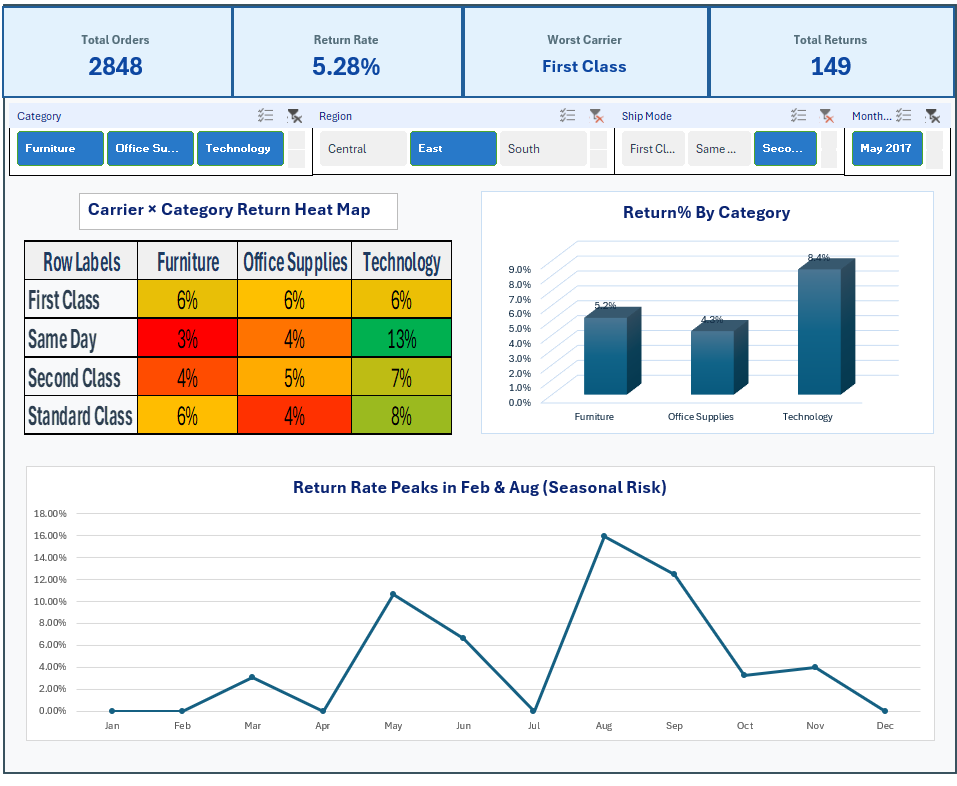

# excel-returns-dashboard
# Returns Analysis Dashboard

I analyzed product return patterns across shipping methods, product categories, and regions using Excel to identify operational inefficiencies and high-risk return segments.

## This dashboard was built to uncover why returns happen and where they are concentrated.
Instead of just visualizing data, the focus was on identifying patterns that could support better business decisions around logistics and product handling.

The dashboard is fully interactive using slicers for dynamic filtering across different dimensions.

## Tools Used
Excel
PivotTables
Slicers (interactive filtering)
Conditional Formatting

##  Key Insights
Same Day shipping showed the highest return rate, suggesting potential issues with rushed fulfillment or expectations mismatch
Technology products had consistently higher return rates compared to other categories
Return activity spikes were observed in February and August, indicating possible seasonal or demand-related patterns

## Business Recommendations
Review Same Day shipping workflow to reduce rushed fulfillment errors
Investigate product quality or description issues in Technology category
Analyze seasonal spikes in returns to adjust marketing or inventory strategy

##  Dashboard Preview

##  Project Files
- returns_analysis_dashboard.xlsx
